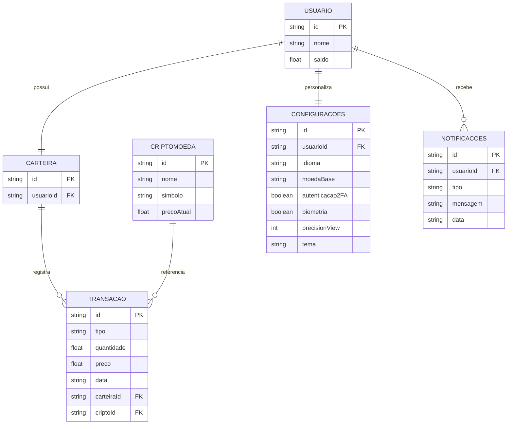

# 🛠️ Especificação Técnica (spec.md)

## 📖 Visão Geral

Este documento descreve como o sistema **Crypto Sandbox** será estruturado tecnicamente, incluindo o modelo de dados e a organização das entidades principais da aplicação.

---

## 🗂️ Modelo de Dados

O sistema será baseado em entidades que representam usuários, criptomoedas, carteira e transações.

---

### 🔧 Tecnologias e Dependências (Versões Exatas)

**Frontend:**
- Bootstrap 5.3.3 - Framework CSS responsivo com componentes prontos
- Chart.js 4.4.1 - Biblioteca para gráficos (linha e pizza)
- Font Awesome 6.5.1 - Ícones SVG escaláveis

**APIs e Serviços:**
- CoinGecko API v3 - Dados reais de criptomoedas em tempo real
- Fetch API - Requisições assíncronas (suporte nativo JavaScript)

**Desenvolvimento e Qualidade:**
- Node.js 20.x LTS - Runtime JavaScript
- npm 10.x - Gerenciador de pacotes e dependências
- ESLint 8.56.0 - Linter para qualidade de código
- Prettier 3.1.1 - Formatador de código automático

**Persistência de Dados:**
- Web Storage (localStorage) - Armazenamento local no navegador
- JSON Server 0.17.4 - API fake para desenvolvimento e testes
