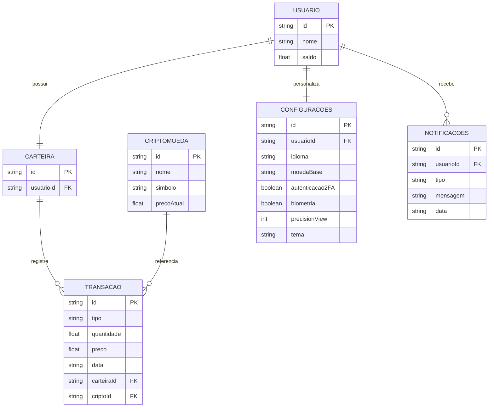

# 🛠️ Especificação Técnica (spec.md)

## 📖 Visão Geral

Este documento descreve como o sistema **Crypto Sandbox** será estruturado tecnicamente, incluindo o modelo de dados e a organização das entidades principais da aplicação.

---

## 🗂️ Modelo de Dados

O sistema será baseado em entidades que representam usuários, criptomoedas, carteira e transações.

---

### 🔧 Tecnologias e Dependências (Versões Exatas)

**Frontend:**
- Bootstrap 5.3.8 - Framework CSS responsivo com componentes prontos
- jQuery 4.0.0 - Biblioteca JavaScript para manipulação do DOM
- uuid 13.0.0 - Geração de identificadores únicos

**APIs e Serviços:**
- CoinGecko API v3 - Dados reais de criptomoedas em tempo real
- Fetch API - Requisições assíncronas (suporte nativo JavaScript)

**Deploy:**
- gh-pages 6.3.0 (dev) - Deploy para GitHub Pages

**Persistência de Dados:**
- Web Storage (localStorage) - Armazenamento local no navegador
