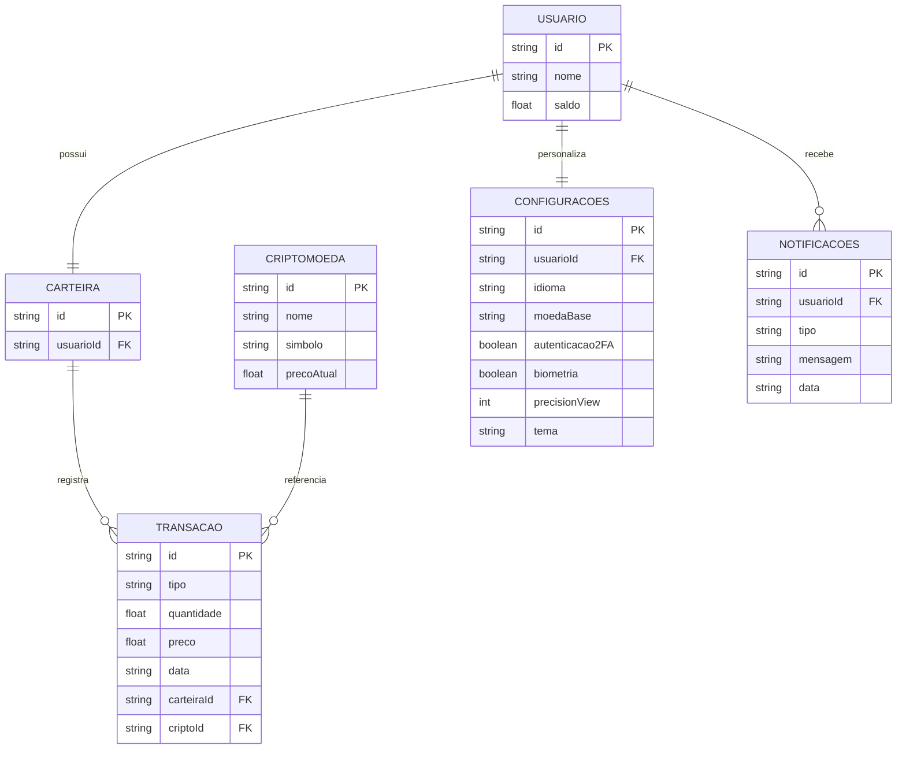

# 🛠️ Especificação Técnica (spec.md)

## 📖 Visão Geral

Este documento descreve como o sistema **Crypto Sandbox** será estruturado tecnicamente, incluindo o modelo de dados e a organização das entidades principais da aplicação.

---

## 🗂️ Modelo de Dados

O sistema será baseado em entidades que representam usuários, criptomoedas, carteira e transações.

